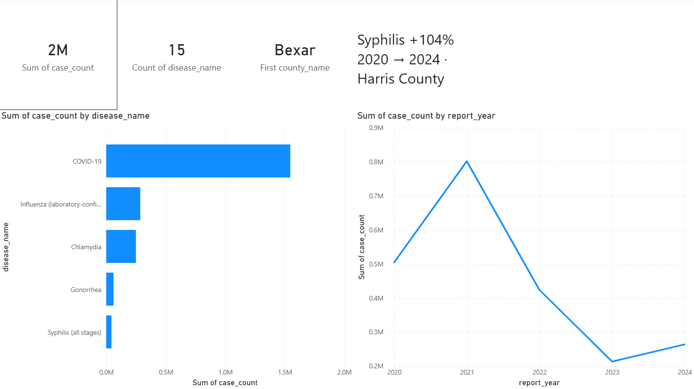
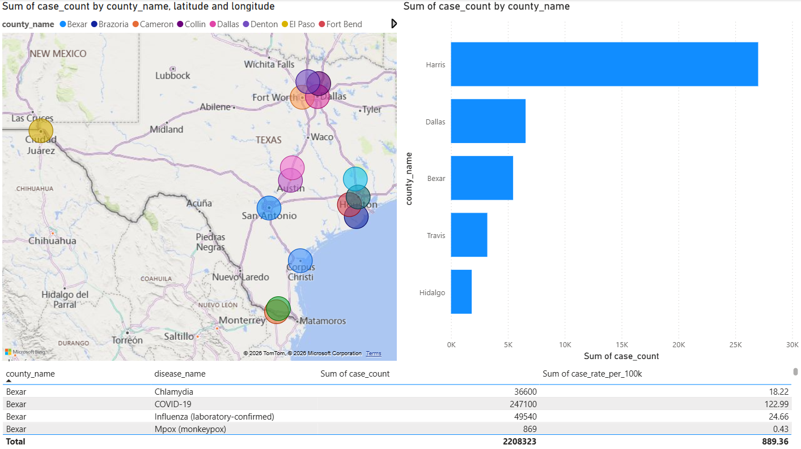
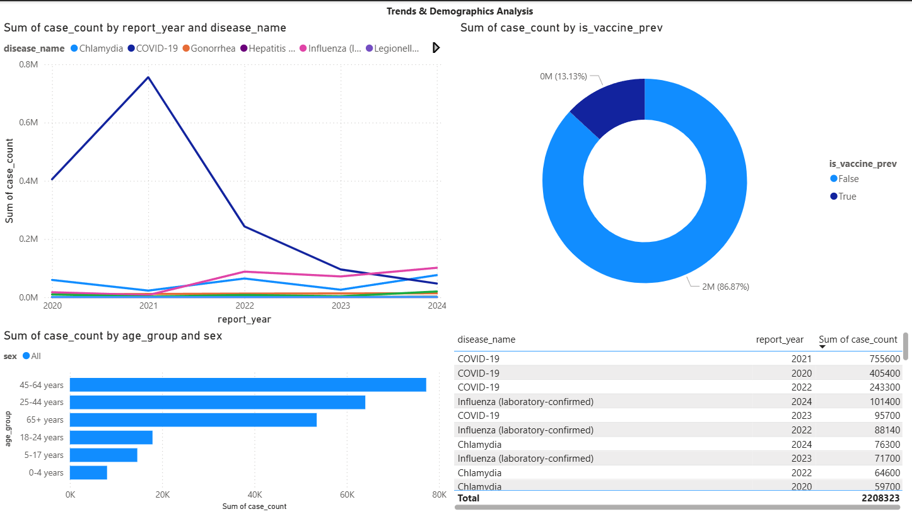

# Texas Public Health Analytics
### Disease Surveillance & Trend Analysis | 2020–2024


---

## Project Overview

This project analyzes **5 years of reportable disease data** across the largest counties in Texas (2020–2024), covering the full COVID-19 pandemic period and its aftermath. The analysis identifies disease trends, geographic disparities, demographic vulnerabilities, and public health policy implications using real data from federal and state surveillance systems.

**Target audience:** Public health departments, hospital systems, healthcare analytics teams in the Houston/Texas area.

---

## Key Findings

| Finding | Detail |
|--------|--------|
| Pertussis rebounded 739% | From 58 cases (2020) to 487 cases (2024) in Harris County — linked to declining childhood vaccination rates |
| Syphilis doubled | 104% increase in Harris County (2,010 → 4,100 cases), declared a public health crisis by Texas DSHS |
| COVID-19 declined 87% | From 142,500 cases (2020) to 18,900 cases (2024) in Harris County |
| 29.5% of cases are vaccine-preventable | Over 27,000 cases in Harris County 2024 could potentially be reduced through targeted vaccination |
| Dallas has the highest disease burden | 17,623 cases per 100k population — highest rate among analyzed counties |

---

## Dataset

| Source | Description | Access |
|--------|-------------|--------|
| CDC NNDSS | National Notifiable Diseases Surveillance System — annual tables by state | [data.cdc.gov](https://data.cdc.gov) |
| Texas DSHS | Texas Department of State Health Services — reportable conditions by county | [dshs.texas.gov](https://www.dshs.texas.gov) |

**Period:** 2020–2024 (2024 data is provisional, published August 2025 per Texas DSHS)  
**Coverage:** 5 counties (Harris, Dallas, Bexar, Travis, Hidalgo) · 15 diseases · 170 records

---

## Database Schema

5 relational tables built in MySQL 8.0:
```
diseases ──────┐
               ├──► disease_cases ◄── counties
disease_metadata      (fact table)
               └──► demographics
```

- `diseases` — catalog of 15 reportable conditions with ICD-10 codes
- `counties` — 15 most populated Texas counties with Census 2020 population
- `demographics` — age groups and sex for vulnerability analysis
- `disease_metadata` — severity, seasonality, and vaccine availability
- `disease_cases` — 170 records of reported cases with rates per 100k

---

## SQL Analysis — 8 Business Questions

| Query | Business Question | Skills Demonstrated |
|-------|-------------------|---------------------|
| Q1 | Which diseases had the most cases in Texas 2020-2024? | JOIN, GROUP BY, SUM |
| Q2 | Which counties have the highest STI rates in 2024? | Multiple JOINs, rate normalization |
| Q3 | Which diseases grew the most between 2020 and 2024? | CASE WHEN, % change, NULLIF |
| Q4 | Which age groups are most vulnerable to Influenza? | RANK() window function |
| Q5 | What % of cases are vaccine-preventable? | Subquery in SELECT |
| Q6 | What is the 5-year trend for top 5 diseases? | Multi-year trend analysis |
| Q7 | Do diseases follow seasonal patterns? | 3-table JOIN, metadata analysis |
| Q8 | What is the public health profile of each county? | CTE (WITH clause) |

---
## Dashboard Preview

**Page 1 — Executive Summary**


**Page 2 — Geographic Analysis**


**Page 3 — Trends & Demographics**


## Project Structure
```
texas-public-health-analytics/
│
├── sql/
│   ├── 01_create_tables.sql      # Database schema - 5 relational tables
│   ├── 02_insert_data.sql        # Dataset - disease cases 2020-2024
│   └── 03_analysis_queries.sql   # 8 business analysis queries
│
└── README.md
```
---

## How to Run This Project

1. Install MySQL 8.0 and MySQL Workbench
2. Open MySQL Workbench and connect to your local instance
3. Run `01_create_tables.sql` to create the database and tables
4. Run `02_insert_data.sql` to load the dataset
5. Run any query from `03_analysis_queries.sql` to explore the data

---

## About

**Author:** Juan Pablo Hernandez  
**Location:** Houston, TX  
**Tools:** MySQL 8.0 · MySQL Workbench · Power BI  
**Data sources:** CDC NNDSS · Texas Department of State Health Services  

*This project was built as part of a data analytics portfolio focused on public health surveillance in Texas.*
